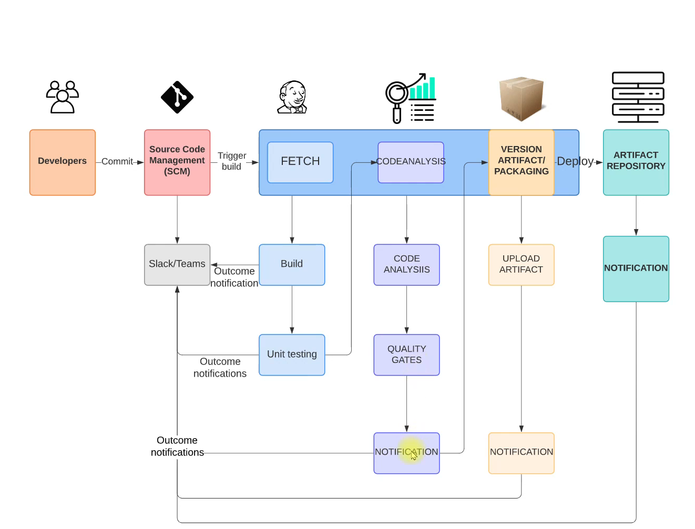
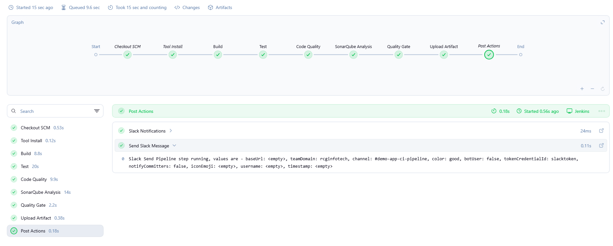
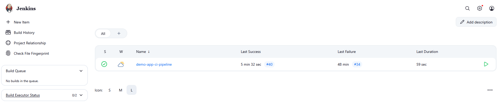
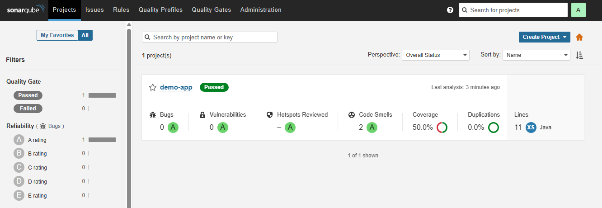
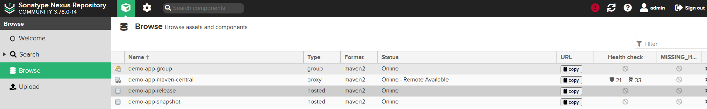
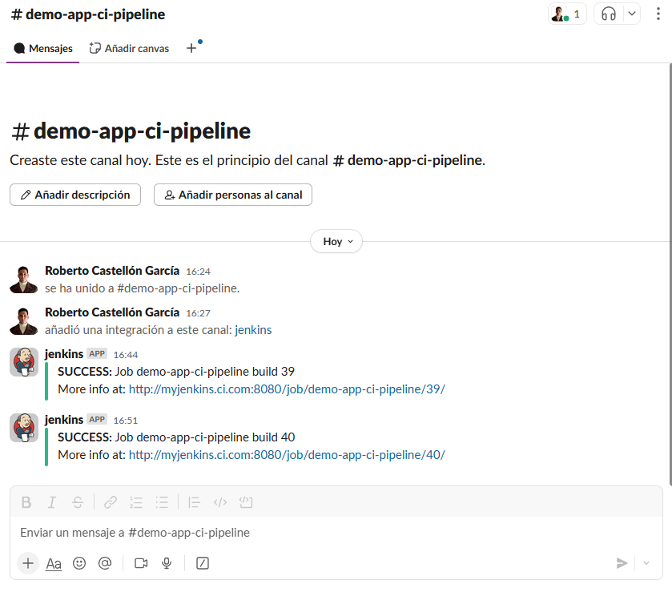

# Jenkins CI Pipeline Demo App



Demo of a **complete Continuous Integration (CI) pipeline** for a Java Maven application using Jenkins, Nexus, SonarQube, and Slack.

## Repository

[GitHub Repository](https://github.com/Roberto-1998/jenkins_ci_pipeline_demo_app)

## Project Structure
- **Pipeline Overview:**   
```
.
|-- Jenkinsfile
|-- architecture
|   `-- project-architecture.png
|-- screenshots
|   |-- ci-pipeline.png
|   |-- jenkins-general.png
|   |-- nexus-integration.png
|   |-- slack-integration.png
|   `-- sonarqube-integration.png
|-- settings.xml
`-- simple-java-maven-app
    |-- LICENSE.txt
    |-- README.md
    |-- pom.xml
    `-- src
        |-- main
        `-- test
```

## Pipeline Overview

The CI pipeline is defined in the `Jenkinsfile` and follows these stages:

### 1. Build
  
- Runs `mvn clean package` to compile the application.
- Archives the resulting `.jar` artifacts.
- **Note:** We had to install Maven and JDK tools in Jenkins and configure credentials for Nexus and SonarQube for communication between Jenkins and these services.

### 2. Test
- Runs unit and integration tests with `mvn test` and `mvn verify`.
- The `pom.xml` was modified to include the **JaCoCo plugin** for test coverage reporting.

### 3. Code Quality
  
- Executes Checkstyle and generates code quality reports.
- Configured a **custom Quality Gate** in SonarQube to ensure project-specific quality standards.
- Webhooks were set up in GitHub and SonarQube to enable automated communication and feedback.

### 4. SonarQube Analysis
- Analyzes source code, test coverage, and reports from JaCoCo.
- Generates actionable insights to maintain code quality.

### 5. Quality Gate
- Pipeline fails if SonarQube analysis does not meet the required Quality Gate status.

### 6. Artifact Management
  
- Artifacts are uploaded to **Nexus**.
- Nexus is configured as a proxy for global dependencies to improve build speed.
- The `settings.xml` file configures Nexus both for downloading dependencies and uploading final artifacts.

### 7. Notifications
  
- Slack notifications are sent with the build result.
- Color-coded messages indicate build success, unstable, or failure.

## Tools and Technologies

- **Jenkins**: CI orchestration, job execution, and plugin management.
- **Maven**: Project build, dependency management, and plugin integration.
- **Nexus**: Artifact repository and dependency proxy to accelerate builds.
- **SonarQube**: Code quality analysis and coverage reports.
- **Slack**: Real-time build notifications.
- **GitHub**: Source code hosting, integrated via webhooks.
- **Java 21**: Application runtime.
- **JaCoCo**: Test coverage analysis.

## Running the Pipeline

1. Clone the repository:

```bash
git clone https://github.com/Roberto-1998/jenkins_ci_pipeline_demo_app.git
cd jenkins_ci_pipeline_demo_app
```

2. Configure Jenkins:
   - Install required tools and plugins (Maven, JDK, SonarQube Scanner, Slack Notification Plugin, Nexus Artifact Uploader).
   - Create credentials for Nexus, Slack, and SonarQube.
   - Add the `Jenkinsfile` pipeline to a new Jenkins job.

3. Run the Jenkins job:
   - Verify artifacts in Nexus.
   - Check code quality and test coverage in SonarQube.
   - Observe notifications in Slack.

---


